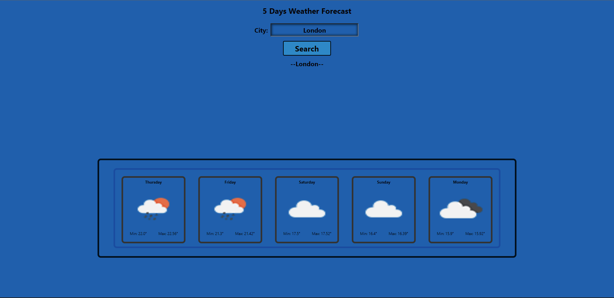

I have created a weather app where a 5 day forecast can be viewed using the api I used. It updates every 3 hours so if there is a change in forecast it will be updated.

Deployed link : https://rezz1420.github.io/Weather-Dashboard/
github link : https://github.com/rezz1420/Weather-Dashboard

Preview : 
